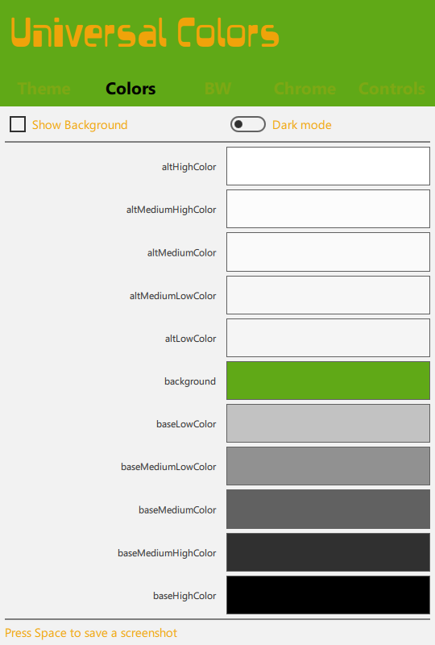
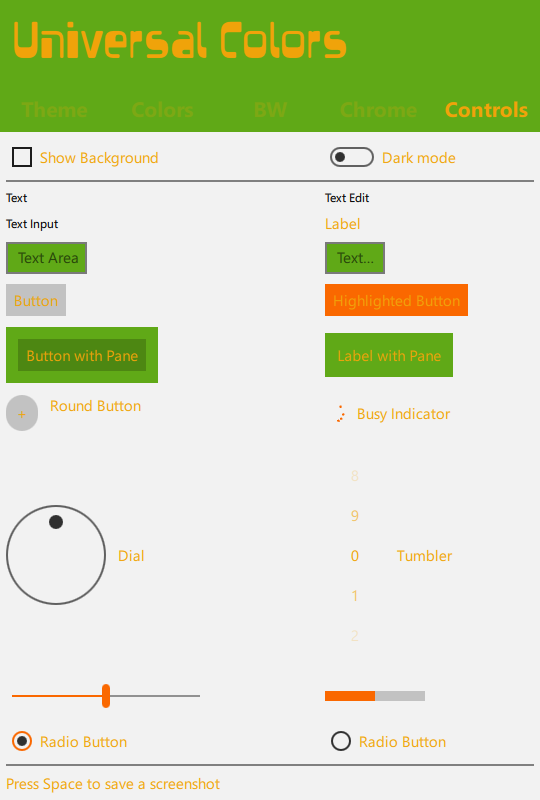
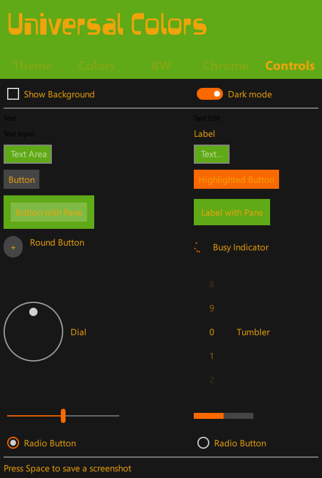

# QML Universal Colors

## Description 

This utility is dedicated for C++ application development, using QML and Qt framework.

If you choose the "Microsoft Universal Style" for your QML application, this utility will helpfully display the main colors (background, foreground and accentuated), the derived colors (darker and lighter) and the *controls* appearence (buttons, sliders...)

## Screenshots

### Theme page

select the colors of your style and the light or dark mode. 

### Color page 

Here you can discover the *Base* and *Alt* declinaisons of your background color. These colors invert when you switch from light to dark mode.

### Chrome page

This page displays the *Chrome* and *Chrome Alt* colors.

### Chrome White and Chrome Black 

These colors do not invert.  
*Chrome White* colors stay more or less white, in light mode and in dark mode.
Same thing for *Chrome Black*.

### Controls

the page displays the QtQuick controls, as they are, from the shelf.

