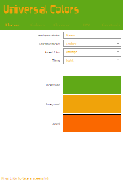
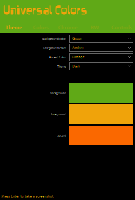
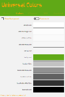
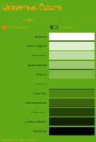
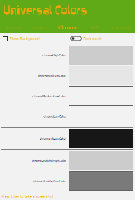
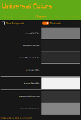
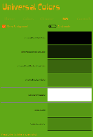
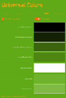
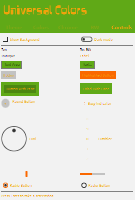
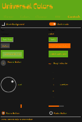

# QML Universal Colors

## Description

This utility is dedicated for C++ application development, using QML and Qt framework.

If you choose the "Microsoft Universal Style" for your QML application, this utility will helpfully display the main colors (background, foreground and accentuated), the derived colors (darker and lighter) and the *controls* appearence (buttons, sliders...).

---

> **Author: david de Lorenzo**

---

## Screenshots

### Theme page

Select the colors of your style and the mode: *light* or *dark*. 

### Color page

Here you can discover the *Base* and *Alt* declinaisons of your background color. These colors **invert** when you switch from *light* to *dark* mode.

### Chrome page

This page displays the *Chrome* and *Chrome Alt* colors.  
These colors **invert** when you switch from *light* to *dark* mode.

### Chrome Black and Chrome White

These colors **do not invert**.  
*Chrome White* colors stay more or less white, in *light* mode and in *dark* mode.
Same thing for *Chrome Black*.

### Controls

The page displays the QtQuick controls, as they are, from the shelf.

